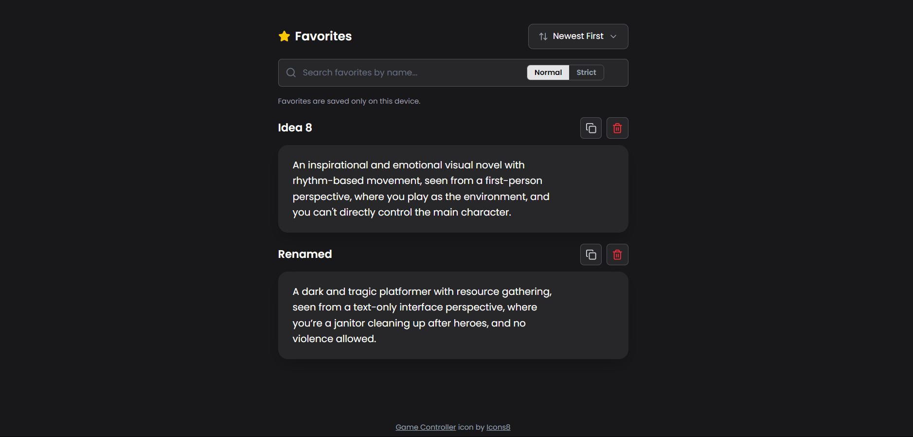
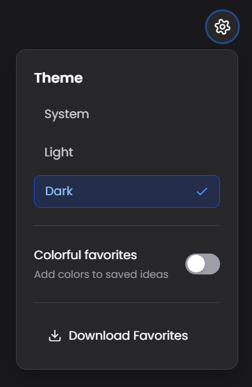

# 🎮 Game Idea Generator

A fun and simple app that generates unique game ideas based on randomized genres, tones, mechanics, and more. Built with React, Tailwind CSS, and Framer Motion.

## ✨ Features

- 🎲 Randomly generate creative game ideas
- 🔒 Lock specific categories to preserve favorite traits
- ⭐ Save your favorite ideas locally (with editable names)
- 🔍 Search saved ideas with optional exact match
- 🗑️ Remove saved ideas with undo support
- 🖌️ Optional color-coded favorites
- 🌙 Light, dark, and system theme support
- 🎮 Responsive design with smooth animations
- 📥 Download your saved ideas as a `.json` file

## 🚀 Demo

[👉 Try the Live App](https://gameideas.vercel.app/)

## 🖼️ Screenshots

### 🌙 Idea Generator (Dark Mode)


### ⭐ Favorites Section with Search & Color



### ⚙️ Setting Panel



## 🛠️ Built With

- [React](https://reactjs.org/)
- [Vite](https://vitejs.dev/)
- [Tailwind CSS](https://tailwindcss.com/)
- [Framer Motion](https://www.framer.com/motion/)
- [Lucide Icons](https://lucide.dev/)
- [Sonner (toast notifications)](https://sonner.emilkowal.ski/)

## 📦 Installation

```bash
git clone https://github.com/NElhamy/game-idea-generator.git
cd game-idea-generator
npm install
npm run dev
```

## 📁 Folder Structure (Simplified)

```
src/
├── components/         # Reusable UI components (IdeaCard, SettingsPanel, etc.)
├── data/               # Static data for genres, tones, etc.
├── App.tsx             # Main app logic
└── main.tsx            # Entry point
```

## 🔧 Scripts

```
npm run dev       # Start the development server
npm run build     # Create a production build
npm run preview   # Preview the production build locally
```

## 📄 License

MIT License — free to use, modify, and distribute.
