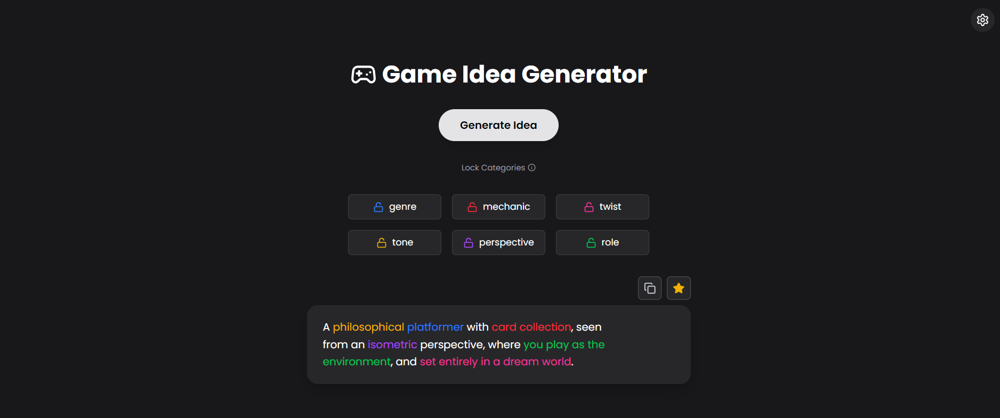

# 🎮 Game Idea Generator

A creative tool for game developers and enthusiasts to generate unique game concepts by combining randomized genres, tones, mechanics, and narrative elements. Built with modern web technologies for a smooth, responsive experience.





## 🌐 Live Demo

Try it out: [gameideas.vercel.app](https://gameideas.vercel.app)


## ✨ Features

- 🎲 **Instant Generation** - Create unique game ideas with one click
- 🔒 **Smart Locking** - Lock specific elements while randomizing others
- ⭐ **Favorites System** - Save and organize your best ideas with custom names
- 🔍 **Advanced Search** - Find saved ideas with normal or exact-match search
- 🎨 **Visual Customization** - Toggle color-coded categories for better readability
- 🌓 **Theme Support** - Seamless light, dark, and system theme switching
- 💾 **Data Export** - Download your collection as JSON for backup or sharing
- ♻️ **Undo Support** - Restore accidentally deleted favorites
- 📱 **Fully Responsive** - Works perfectly on desktop, tablet, and mobile


## 🚀 Getting Started

### Prerequisites

- Node.js 16+ and npm/yarn installed
- Git (for cloning the repository)

### Installation

```bash
# Clone the repository
git clone https://github.com/NElhamy/game-idea-generator.git

# Navigate to project directory
cd game-idea-generator

# Install dependencies
npm install

# Start development server
npm run dev
```


## 🛠️ Tech Stack

- **Framework:** [React 18](https://reactjs.org/) with TypeScript
- **Build Tool:** [Vite](https://vitejs.dev/)
- **Styling:** [Tailwind CSS](https://tailwindcss.com/)
- **Animations:** [Framer Motion](https://www.framer.com/motion/)
- **Icons:** [Lucide React](https://lucide.dev/)
- **Notifications:** [Sonner](https://sonner.emilkowal.ski/)


## 📁 Project Structure

```
src/
├── components/         # Reusable UI components
│   ├── IdeaCard.tsx
│   ├── SettingsPanel.tsx
│   ├── FavoritesList.tsx
│   └── ...
├── data/              # Game element datasets
├── hooks/             # Custom React hooks
├── types/             # TypeScript type definitions
├── utils/             # Helper functions
└── App.tsx            # Main application component
```


## 🔧 Available Scripts

```bash
npm run dev       # Start development server with hot reload
npm run build     # Build for production
npm run preview   # Preview production build locally
npm run lint      # Run ESLint
```


## 🤝 Contributing

Contributions are welcome!

1. Fork the repository
2. Create your feature branch (`git checkout -b feature/AmazingFeature`)
3. Commit your changes (`git commit -m 'Add some AmazingFeature'`)
4. Push to the branch (`git push origin feature/AmazingFeature`)
5. Open a Pull Request


## 📄 License

This project is licensed under the MIT License - see the [LICENSE](LICENSE) file for details.


## 🙏 Acknowledgments

Game controller icon by Icons8
